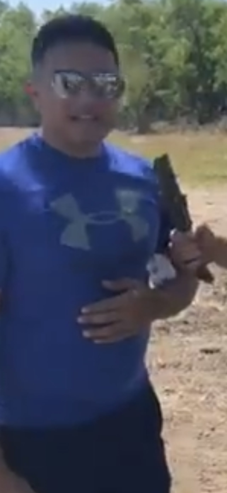
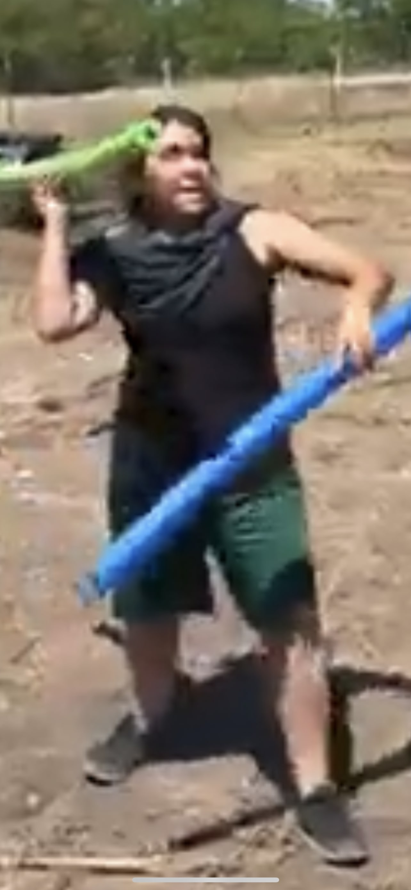
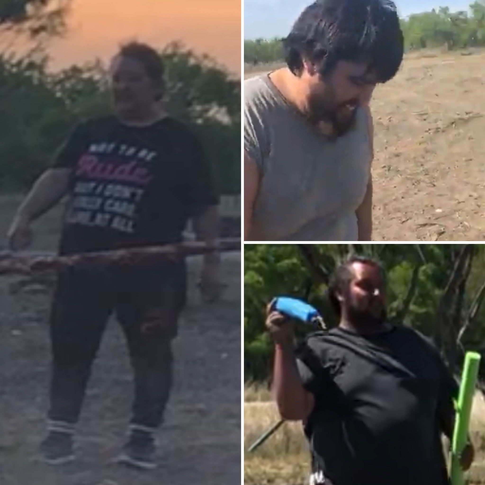

# Obstacle Course

---

(March 31st, 2018)

---

## Description

An open invitation was extended to anyone bold enough to test the limits of their physical and mental resilience. Competitors faced off in a series of heats, each designed to push them to their edge. While participants were allowed multiple runs, only their first attempt counted toward their official time.

The course was a gauntlet of challenges, demanding a full spectrum of abilities—strength, speed, endurance, balance, creativity, grit, and sheer determination. Completion times ranged widely, with some finishing in just 20 minutes and others battling through for over an hour.

To cap off the event, a unique team challenge awaited. Groups of three had to navigate the final obstacle together—one member unable to hear, another unable to speak, and the third unable to see. Success required trust, coordination, and a deep understanding of each other's strengths.

---

## Winner(s)

  

    
    

        Art
    

  

    

    
    

      Jasmin
    

  

    

    
    

      Team FAT
    

  

  <!-- 

    
    

      
Fourth Card

    

  

  

    
    

      
Card Five

    

  
 -->

Males: Art with time of 20:03

Teams: Team FAT (Marisa, Tony, Joey) with time of 28:04

Females: Jasmin with time of 38:30

---

<figure>

<iframe width="560" height="315" src="https://www.youtube.com/embed/L9Ejafc20YI" title="YouTube video player" frameborder="0" allow="accelerometer; autoplay; clipboard-write; encrypted-media; gyroscope; picture-in-picture" allowfullscreen></iframe>

  <figcaption style="font-family: 'Papyrus'; margin-bottom: 0em; font-size: 1em">We see Jasmin Vs. Martha while reporter Frank interviews Art whom holds the fastest time</figcaption>
</figure>
