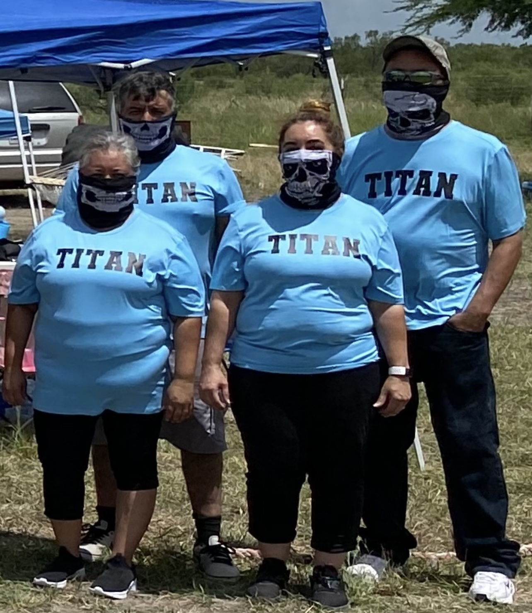

# Season 4

---

(August 21st, 2021)

---

## Description

This season raised the stakes higher than ever before. Contestants battled their way in through an open casting call, all chasing the biggest cash prize yet. With the daring option to double their entry fee, players had the chance to build a side pot—pushing the prize pool to over $1,200 on the line.

The competition kicked off with the Golden Skull Challenge, a high-intensity scavenger hunt where the winner earned the ultimate advantage: first choice of their partner from the opposite team. Hidden within the chaos was a powerful ticket granting its holder the ability to swap out any challenger for elimination.

And just when players thought they had the game figured out… the TITAN Surprise Challenge was unleashed, throwing the competition for a loop!

Packed with twists, hidden advantages, and relentless obstacles, this season showed how entertainingly chaotic these games can be!

---

## Meet The Cast

<figure>

<figcaption style="max-width: 34rem; font-family: 'Papyrus'; margin-bottom: 0em; font-size: 1em"><b>Front/females: </b>Athena, ???, Elsa, Felicia, Yesseñia, Arianna, Crystal, Wendy, Jasmin, Alex, Nevaeh, Melina, Cookie</figcaption>
<figcaption style="max-width: 34rem; font-family: 'Papyrus'; margin-bottom: 0em; font-size: 1em"><b>Back/males: </b>Atticus, Noe, Andrew, Frank, John, Dante, Angel, Victor, Oscar, Che, Sebastian, Art, Kevin</figcaption>
</figure>

## Titan Challenge

<video controls>
  <source src="../../images/Titan_reveal.mp4" type="video/mp4">
Your browser does not support the video tag.
</video>

TITAN – a force of overwhelming strength, intellect, and dominance. From its Greek roots meaning “Defender”, the name alone strikes fear into challengers.

But this season, Titans weren’t just mythology—they were real. In a shocking last-minute twist, four heavy-hitting TITANS were introduced into the game. Their presence came with a ruthless, but rewarding clause: take down a Titan and you instantly pocket $50 for each one defeated.

A surprise that turned contenders into hunters… and raised the stakes to even further.

<figure>

<figcaption style="max-width: 34rem; font-family: 'Papyrus'; margin-bottom: 0em; font-size: 1em"><b>Front/females: </b>Marisa & Mirna</figcaption>
<figcaption style="max-width: 34rem; font-family: 'Papyrus'; margin-bottom: 0em; font-size: 1em"><b>Back/males: </b>Miguel & Greg</figcaption>
</figure>

---

## Finalists

### Sebastian, Angel, Kevin, Melina, Crystal, Wendy

---

## Winners

<!--  -->

  🥉 Kevin
  🥇 Angel
  🥈 Wendy

