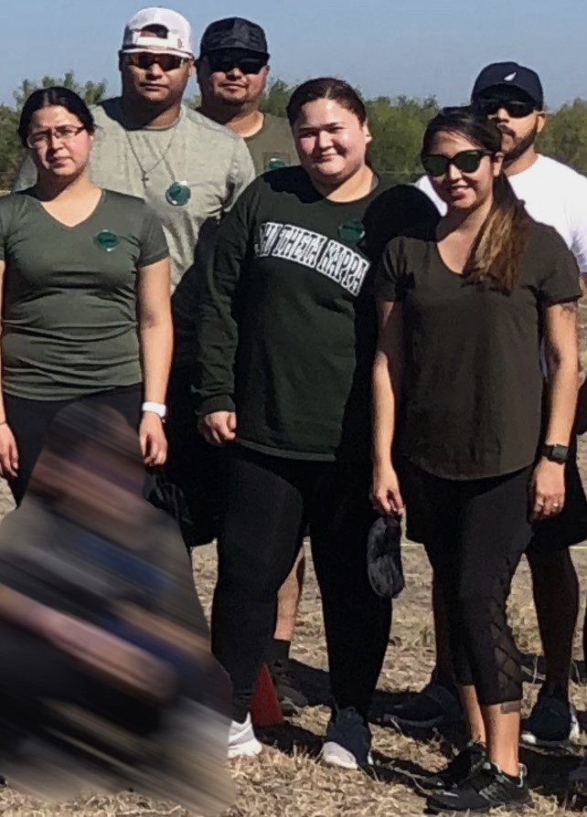

# Season 3

---

(November 30th, 2019)

---

## Description

The Arena Was Set. The Battle Was On.
It began with a call to arms: contestants submitted their bids to become captains. From the chaos, six emerged—three men and three women—each chosen to lead. Their mission? Assemble a team of warriors: three males, three females, including themselves. They recruited, they trained, and they arrived ready to conquer.
But just as the dust settled and the games were about to begin... a twist. A seventh team stormed in—unannounced, unshaken, and ready to disrupt. The battlefield now held 42 fierce competitors, and the stakes had never been higher.

Challenge after challenge, the arena roared. After each round, one man and one woman were thrown into head-to-head eliminations. It was brutal. It was relentless. Only the strongest clawed their way back to their teams.

As the sun dipped below the horizon, ten warriors remained. Ten who had endured the trials, the betrayals, the blood and sweat. They faced the final gauntlet—a test of everything they had left.
And when the dust finally cleared, one gladiator stood alone. Victorious. Unbreakable. The champion of champions.

---

## Meet The Cast

<figure>

<figcaption style="font-family: 'Papyrus'; margin-bottom: 0em; font-size: 1em">The entire season cast before the start of the games.</figcaption>
</figure>

## Meet Teams

  

    
    

        Pink Panthers
    

  

    

    
    

      Fallen Blades
    

  

    

    
    

      Green Team
    

  

  

    
    

    Honey Badgers
    

  

  

    
    

    Storm Team
    

  

    

    
    

    Blue Team
    

  

    

    
    

    Team Chaos
    

  

Team Chaos joins the rest of the cast as a surprise 7th team to stir up the pot

---

## Finalists

---

## Winner

<figure>

  🥇 Chris

</figure>
